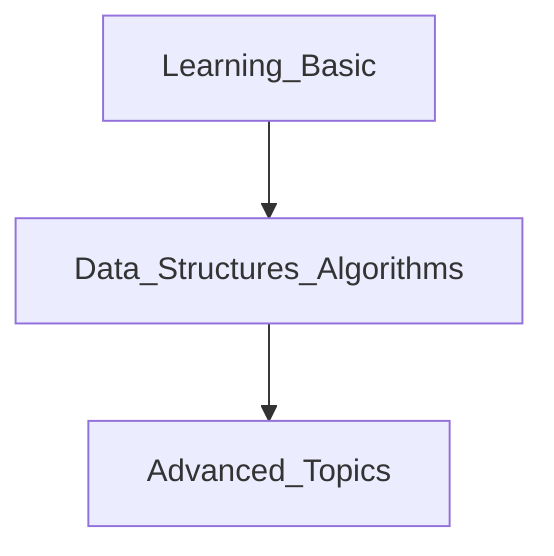

# Python_learning

For member who want to learn more about python

> Roadmap for python
> - https://roadmap.sh/python

## Setup enviroment
1. Install Python<br>
Step1: Click [download here](https://www.python.org/downloads/) and install a stable version of Python as you want (we chose the Python 3.10 version)<br>
Step2: Run Executable Installer and make sure to select both the checkboxes (Install launcher... && Add Python PATH)<br>
Step3: Verify Python is installed on Windows<br>
    - Open the command prompt.
    - Type ```python --version```
    - Check the version of python which you have installed (it will be displayed if the python is successfully installed on your windows)

2. Install IDEs and Code Editors<br>
> An IDE (or Integrated Development Environment) is a program dedicated to software development. As the name implies, IDEs integrate several tools specifically designed for software development. <br>
> In contrast, a dedicated code editor can be as simple as a text editor with syntax highlighting and code formatting capabilities. Most good code editors can execute code and control a debugger.

※I want to suggest Visual Studio Code but you can use anything you want. Let's see below:
- [Visual Studio Code](https://code.visualstudio.com/download)
- [PyCharm](https://www.jetbrains.com/ja-jp/pycharm/download/)
- ...

3. Some extension and setup VS Code
```rb
Updating...

```

## Learning path
1. Follow roadmap
2. Create check list at issues
3. Follow schedule and please write report everyday



Learning Path 1
```rb
# Learn The Basics
- [ ] Basic Syntax
- [ ] Variables
- [ ] Conditionals
- [ ] Typecasting
- [ ] Functions
- [ ] Lists, Tuples, Sets, and Dictionaries

# Data Structures and Algorithms
- [ ] Arrays and Linked lists
- [ ] Heaps Stacks and Queues
- [ ] Hash Tables

# Advanced Topics
- [ ] Iterators
- [ ] Regular Expressions
- [ ] Decorators
- [ ] Lambdas
- [ ] Pip
- [ ] List Comprehensions
- [ ] Generator Compressions
- [ ] Python Paradigms

> OOP
> - [ ] Classes
> - [ ] Inheritance
> - [ ] Methods and Dunder

```

Learning Path 2 - Selenium
```rb
Updating...

```
