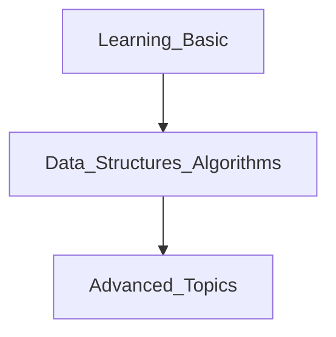

# Python_learning

For member who want to learn more about python

> Roadmap for python
> - https://roadmap.sh/python

## Learning path
1. Follow roadmap
2. Create check list at issues
3. Follow schedule and please write report everyday



Learning Path 1
```rb
# Learn The Basics
- [ ] Basic Syntax
- [ ] Variables
- [ ] Conditionals
- [ ] Typecasting
- [ ] Functions
- [ ] Lists, Tuples, Sets, and Dictionaries

# Data Structures and Algorithms
- [ ] Arrays and Linked lists
- [ ] Heaps Stacks and Queues
- [ ] Hash Tables

# Advanced Topics
- [ ] Iterators
- [ ] Regular Expressions
- [ ] Decorators
- [ ] Lambdas
- [ ] Pip
- [ ] List Comprehensions
- [ ] Generator Compressions
- [ ] Python Paradigms

> OOP
> - [ ] Classes
> - [ ] Inheritance
> - [ ] Methods and Dunder

```

Learning Path 2 - Selenium
```rb
Updating...

```
