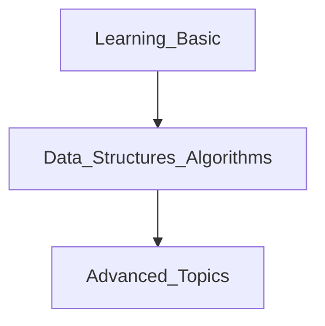

# Python_learning

For member who want to learn more about python

> Roadmap for python
> - https://roadmap.sh/python

## Learning path
1. Follow roadmap
2. Create check list at issues
3. Follow schedule and please write report everyday

